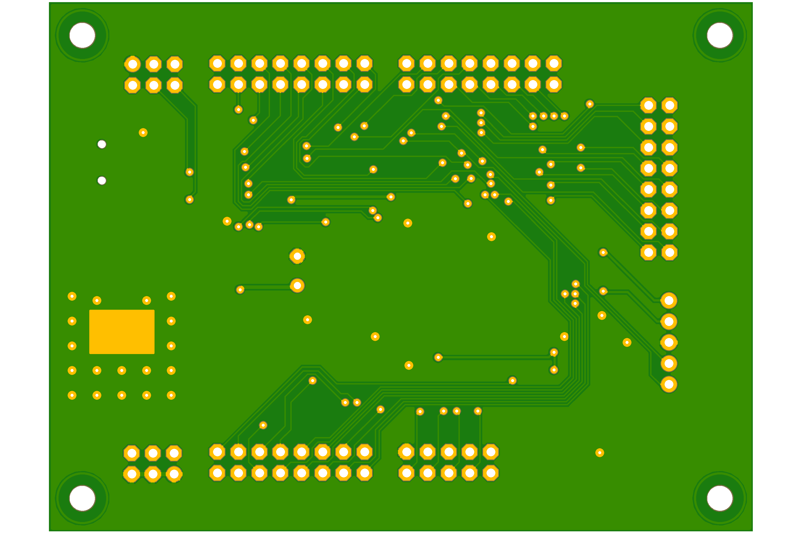

# dspic33ch

Simple development board for 3.3v 80pin TQFP dspic33ch.

- 3.3v LDO powered from 5V USB.
- UART connectivity to USB via ch340 optionally connected using jumpers B1-B2.
- programming interface header.
- With exception of CLKI (B0) and MCLR all other pins are broken out to headers.
- 2 LEDS optionally connected to pins A0-A1 using jumpers.
- 2 Buttons optionally connected to pins A2-A3 using jumpers.

